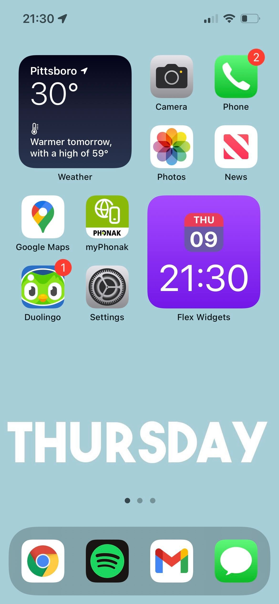
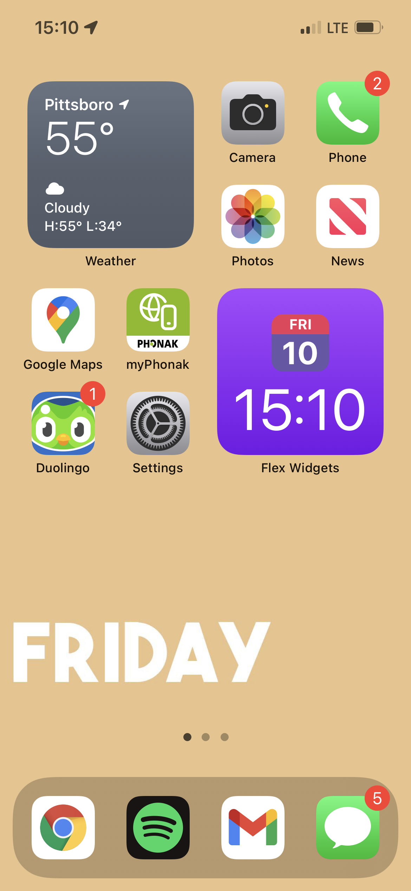

# Mind Tether

Many individuals in many stages of life struggle to stay grounded to the day to day. Whether it's pain or medication induced brain fog, damensia, or a multide of ther things, keeping oneself connected to each day can be an uphill battle.

Mind Tether is designed to provide users with visual indicators in convienient locations to help mentally tether someone back to what the now is.

The current design, v1.0.0, takes advantage of the programability of iPhones through Shortcuts. See [SiriShortcut.md](SiriShortcut.md) for the latest released version of the shortcut.

## Screenshots!
Below are a couple screenshots of what my phone looks like on different days. Please note that apps and widgets are unique to each person's phone. This app is designed to change the phone's background image.

 

## Technical Notes and FAQs
Please see the [Technical Notes and FAQs](TechNotesAndFAQ.md) page.

## Contributing
The goal is to truly open-source the project. That being said, I want to lay some foundation before accepting new contributores. Once the app has a core functionality for a broader range of phones, I hope to welcome curious contributors!
## Feedback
Feedback is welcome! Open an issue for a bug or feature request! 
