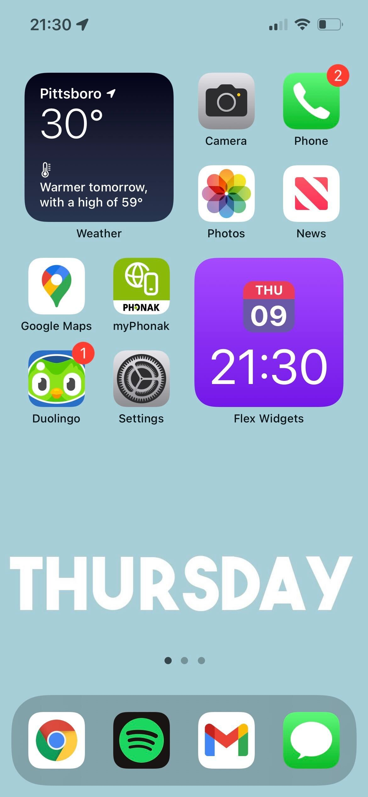
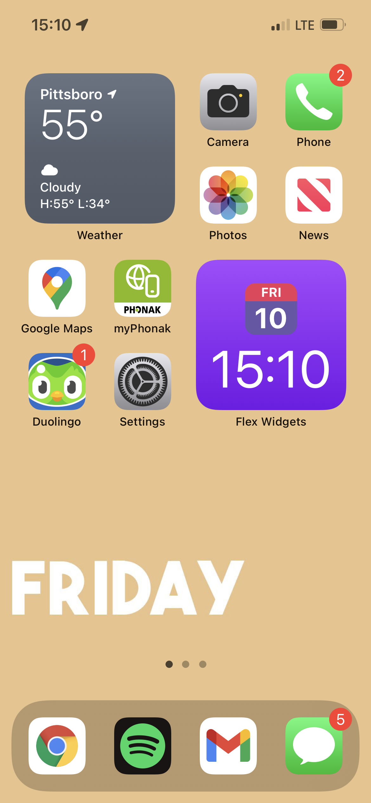

# Mind Tether

Many individuals in many stages of life struggle to stay grounded to the day to day. Whether it's pain or medication induced brain fog, damensia, or a multide of ther things, keeping oneself connected to each day can be an uphill battle.

Mind Tether is designed to provide users with visual indicators in convienient locations to help mentally tether someone back to what the now is.

Currrently, there is no actual app. Mind Tether runs as a Siri Shortcut. Once you install the shortcut, you can automate how frequently to run it. The current recommendation is daily (in the wee morning).

[Click Here](https://www.icloud.com/shortcuts/bc76f16a37ea43aa89018dfd74700375) to get the latest Apple Shortcut
---
Once the shortcut is installed, it will check for future updates and let you know when a newer version is available.

---
## Screenshots!
Below are a couple screenshots of what my phone looks like on different days. Please note that apps and widgets are unique to each person's phone. This app is designed to change the phone's background image.

 

 

--- 

## Learn more, get involved, request a feature
Currently, Mind Tether is in its infancy stage. As Mind Tether grows, I hope to take the functionality far beyond phone backgrounds. Head over to the [GitHub repo](https://github.com/flamingquaks/mind-tether) to find out more! 